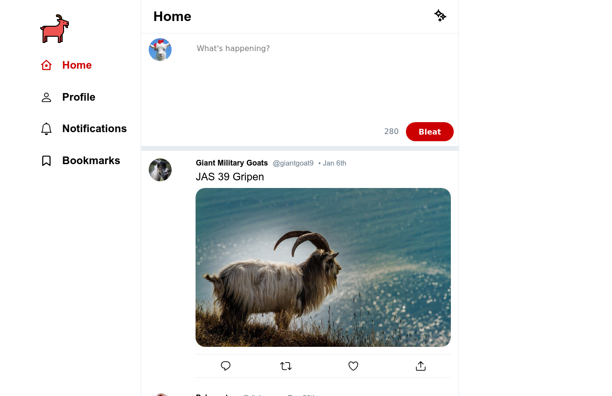

# Goat Bleater
> React Twitter Clone built for Concordia University



## Demo

[View the live demo](https://goat-bleater.herokuapp.com/)


### Deploy the project

__Clone the repo to your local machine using the terminal__:
```
$ git clone git@github.com:andrewbaldwin44/project-m4-twitter-clone.git
```

__Install the Dependencies__:
1. Navigate into the project directory `cd server`
2. Install the required packages `yarn install`
3. Start the development server `yarn start`

This will run the app in the development mode.<br />
Open [http://localhost:3000](http://localhost:3000) to view it in the browser.

The page will reload if you make edits.

__The Server__

A folder is provided, `/server`, with the backend code. This is a local server that you will connect to to retrieve/write the data. An API is provided, and documented in `server/API_DOCS.md`. You can read this document thoroughly to build an understanding of what the different endpoints are, and how they work.

### Technologies Used

__Frontend__:

- React

__Backend__:

- Nodejs
- Express


### Author

👤 **Andrew Baldwin**

- Github: [@andrewbaldwin44](https://github.com/andrewbaldwin44)
